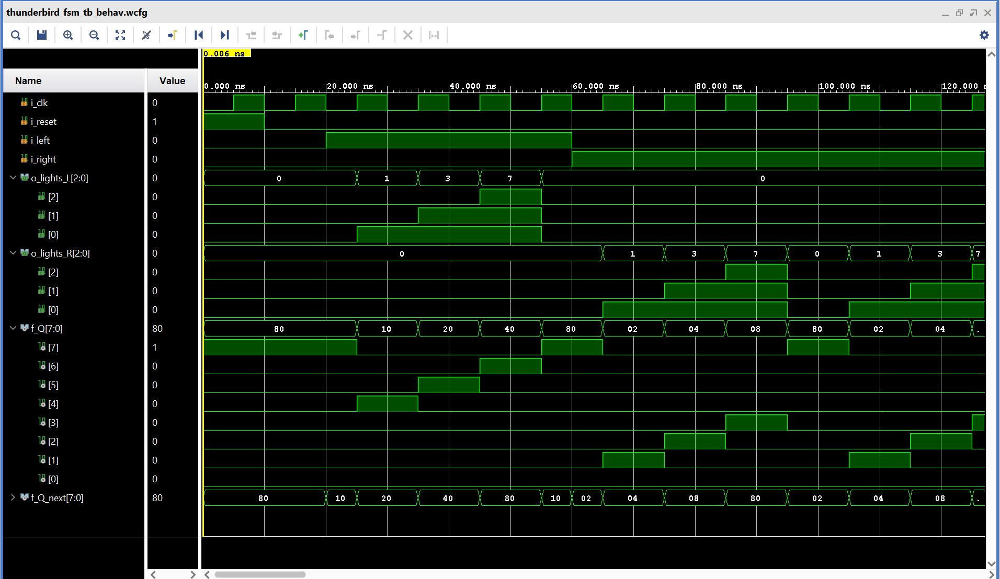

# Lab 3: Thunderbird Turn Signal

VHDL for ECE 281 [Lab 3](https://usafa-ece.github.io/ece281-book/lab/lab3.html)

Targeted toward Digilent Basys3. Make sure to install the [board files](https://github.com/Xilinx/XilinxBoardStore/tree/2018.2/boards/Digilent/basys3).

Built for Vivado 2024.2 on Windows 11.

# Documentation Statement:
I used my notes, the textbook, and recieved help from C3C Alexandra and C3C Tristen. I did not use any other resources
